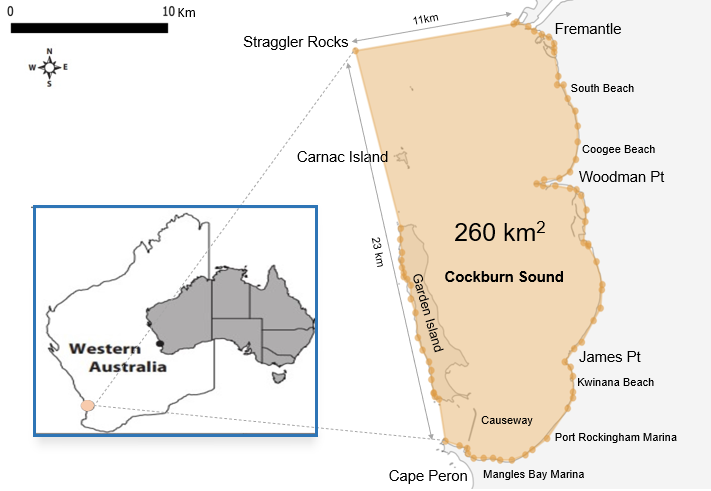

# Cockburn Sound Ecopath Model

## Overview

This repository hosts the **quantitative ecosystem model** of **Cockburn Sound**, Western Australia, developed using the **Ecopath with Ecosim (EwE)** framework. The model represents the trophic structure and interactions among key biological components of the Sound — from phytoplankton and invertebrates to fish, birds, and marine mammals.

Ecosystem models aim to represent ecological systems by quantifying interactions among their components, from individual populations to communities and entire biomes.  
Among various ecosystem modelling tools, **Ecopath with Ecosim (EwE)** — an **energy-balance trophic model** — is one of the most widely applied frameworks globally, with over **800 published models** ([www.ecopath.org](https://www.ecopath.org)).

### Applications of EwE

The EwE model has been applied in diverse contexts including:

- Ecosystem-based management (Plaganyi & Butterworth)  
- Climate change impacts (Brown et al., 2010)  
- Fishing and harvest effects (Lozano-Montes et al., 2013)  
- Spatial closures (Lozano-Montes et al., 2012)  
- Artificial reefs (Wu et al., 2016)  
- Aquaculture impacts (Han et al., 2017)  

Since its inception in the 1980s (Polovina, 1984), EwE has become the standard for marine ecosystem trophic modelling.

---

## Purpose of the Model

The **Cockburn Sound EwE model** aims to:

1. **Characterise the trophic structure**, key ecosystem attributes, and overall functioning of Cockburn Sound.  
2. **Integrate historical and recent datasets** — from fisheries, ecological monitoring, and the WAMSI Westport research program — into a unified quantitative ecosystem framework.  
3. **Support ecosystem-based synthesis** and management strategies for the Sound.  
4. **Quantify food-web interactions** to identify key energy pathways and trophic dependencies.  
5. **Explore management and climate scenarios** to assess ecological flow-on effects of anthropogenic and environmental changes.

---

## Tools and Data Sources

The model development combines:

- Historical fishery datasets  
- Data from the **WAMSI Westport Program**  
- Expert input from **DPIRD**, **ECU**, **Murdoch University**, **UWA**, and **CSIRO**  

The **Ecopath software** ([www.ecopath.org](https://www.ecopath.org)) was used to integrate and quantify these datasets into a cohesive trophic model.

---

## Modelling Approach

The **Ecopath** model assesses:

- **Intra- and inter-specific competition** among functional groups  
- **Predation dynamics** for commercial, recreational, and conservation species  
- **Energy flow** among trophic levels  
- **Ecosystem impacts** of fishing, port development, and climate change  

Key ecological groups include target fish species, higher predators (e.g. Australian Sea Lion, Bottlenose Dolphin, Little Penguin, migratory seabirds), demersal and pelagic assemblages, invertebrates, and primary producers.

The EwE framework provides the **quantitative basis** needed to evaluate potential ecosystem responses under different management and environmental scenarios.

---

## Model Domain

The model domain covers approximately **130.3 km²**, representing the **embayment of Cockburn Sound** in the depth range of **0–20 m**.

It includes key components of the Sound’s food web:

- Commercially important species  
- Recreationally targeted species  
- Species of conservation concern  
- Demersal and pelagic fish assemblages  
- Invertebrates and primary producers  


> **Figure 1:** Model domain for the Ecopath Cockburn Sound model, covering approximately 260 km².

---

## Functional Groups

A total of **65 functional groups** were defined, representing **over 80 species** based on local biological surveys and expert consultation (DPIRD, ECU, MU, UWA, CSIRO).

Groups were defined to reflect:

- **Commercial/recreational significance:**  
  Pink Snapper, Blue Swimmer Crab, Southern Garfish, Sandy Sprat, etc.  
- **Conservation importance:**  
  Little Penguin, Bottlenose Dolphin, Australian Sea Lion, Cormorants, migratory Waders, Sharks  

🔗 [View the full list of functional groups →](Groups/functional_groups.md)

---

## References

- Polovina, J. J. (1984). *Model of a coral reef ecosystem.* Marine Ecology Progress Series.  
- Plaganyi, E. E., & Butterworth, D. S. (Various years). *Ecosystem-based fisheries management applications.*  
- Brown, C. J., et al. (2010). *Impacts of climate change on marine ecosystems.*  
- Lozano-Montes, H., et al. (2012, 2013). *Trophic modelling of Western Australian marine systems.*  
- Wu, et al. (2016). *Ecosystem effects of artificial reefs.*  
- Han, et al. (2017). *Aquaculture impacts in trophic networks.*

---

## Citation

If you use this model or documentation, please refer to the associated report and citation:

[WAMSI-Westport Marine Science Program](https://wamsi.org.au/research_themes/ecosystem-modelling-2/)

---

## Repository Structure

```
📦 CockburnSound-Ecopath-Model
├── model/                 # Ecopath model files (.ewemdb)
├── Documents/             # Supplementary documentation and tables
├── Groups/                # Full list of functional groups (tables)
├── Inputs/                # Input data: biomass, diet matrix, catches, etc.
├── Outputs/               # Domain map, trophic diagrams, results
├── README.md              # This file
└── LICENSE
```

 